# F1 Databricks Platform 🏎️💨

Inspired by F1, I built an end-to-end Databricks platform on F1 data. It supports both batch and streaming workloads and covers the entire data engineering lifecycle - from data generation to serving. Two types of data are ingested into the platform:

- Historical data on race results (batch)
- Real-time data on track weather conditions, via simulated IoT sensors (streaming)

The data is used to answer the following business questions:

- What is the performance of the top 5 teams over the last 50 years?
- Who are the best drivers in history?
- Which driver/team won the last 10 seasons?
- Which countries produce the most drivers?
- What are the live weather conditions at each track?

## End Result

The end result of this platform is the following dashboard, which answers the business questions

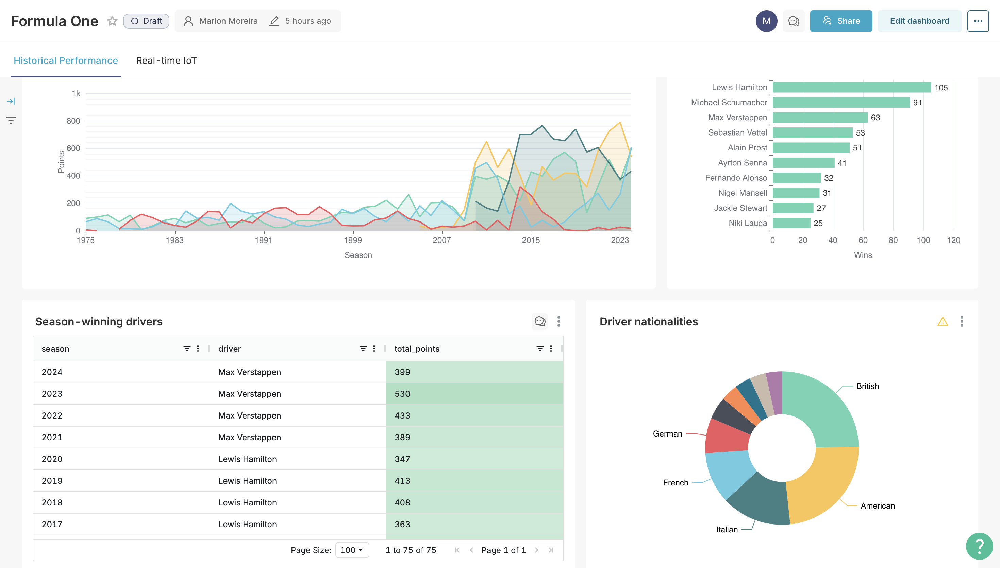
Figure: Historical F1 analysis
 
 

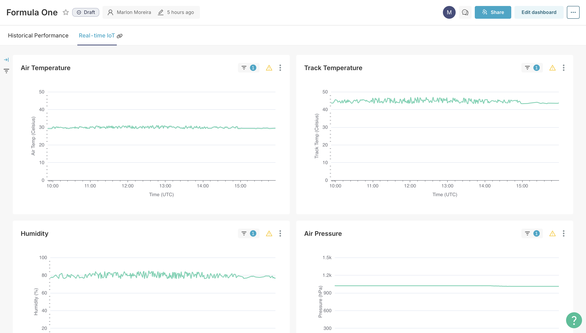
Figure: Real-time IoT readings
 
 

## Solution Architecture

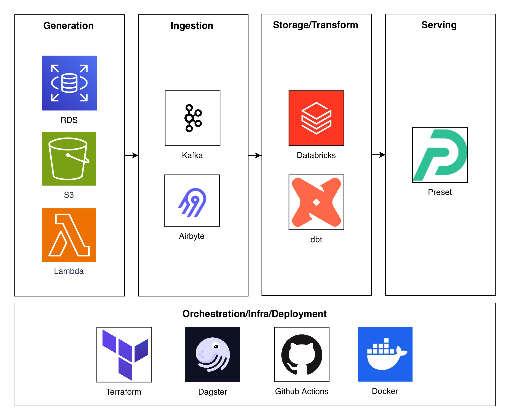
Figure: Simplified architecture
 
 

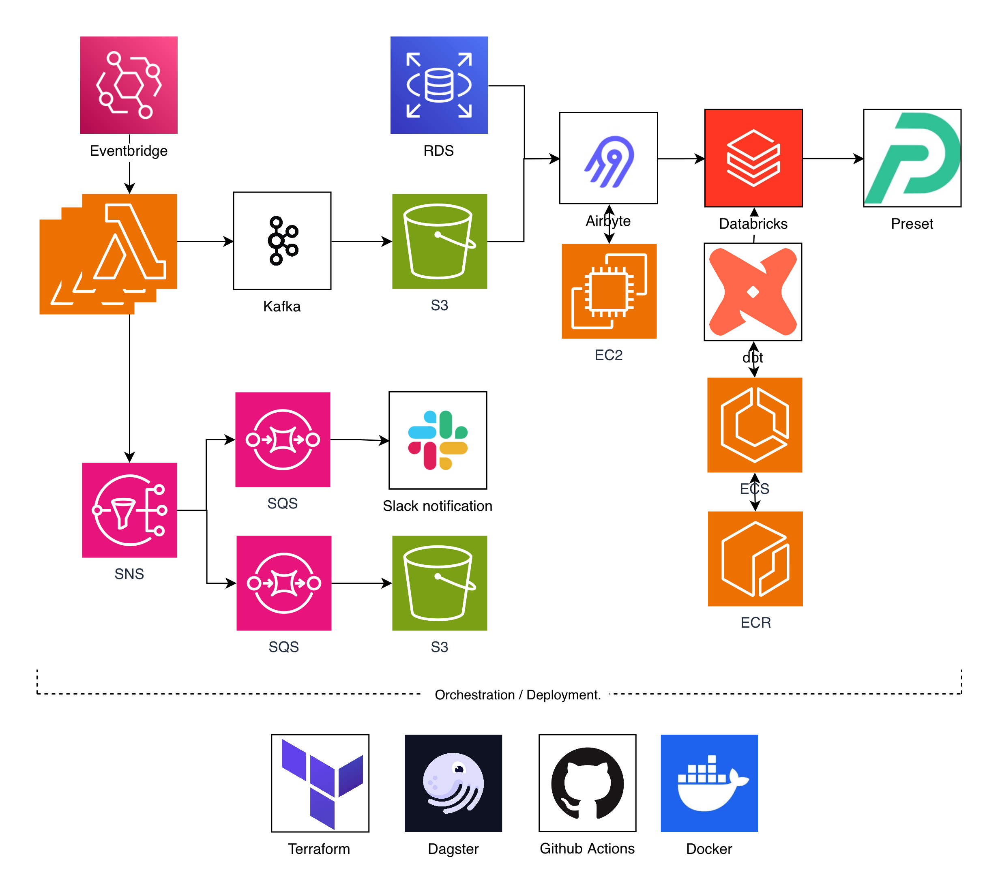
Figure: Detailed architecture
 
 

## Features

- **ELT & Streaming Pipelines**
  - Airbyte pipelines extract and load data from multiple sources
  - Supports batch and streaming
  - Extraction patterns: incremental, full
  - Load patterns: upsert, append, overwrite
  - Kafka buffers IoT streaming data
  - Pipelines orchestrated with Dagster on a schedule

- **Cloud & Infrastructure**
  - Deployed on AWS using Terraform
  - Services: Lambda, ECS, ECR, EC2, S3, RDS, SQS, SNS, EventBridge, IAM

- **Data Modeling & Warehousing**
  - Kimball & OBT modeling with medallion architecture (raw → staging → marts)
  - 3 fact tables, 6 dimension tables, 2 OBT tables
  - SCD2 tables track historical changes
  - Partitioning applied to improve query performance
  - Delta tables provide ACID compliance and time travel

- **Analytics Engineering**
  - SQL transformations using dbt
  - SQL techniques: joins, aggregations, window functions, calculations, CTEs
  - dbt features: macros, generic/custom tests, snapshots, profiles/targets, packages, incremental models
  - SparkSQL used to process dbt transformations on Databricks clusters

- **Python & Orchestration**
  - 6 Lambda functions written in Python
  - Unit testing with pytest
  - Orchestration handled via Dagster
  - Dagster code written in Python

- **CI/CD & Git**
  - GitHub Actions for CI/CD
  - CI/CD pipelines include linting, testing, Docker container builds, and deployments
  - Branch protection rules to enforce PR-based workflow

- **Dashboarding & Semantic Layer**
  - Preset dashboard to answer business questions
  - Semantic layer techniques: calculated metrics and columns

## Screenshots

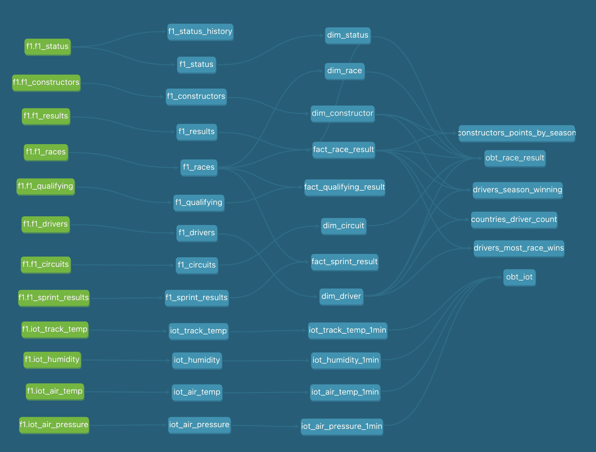
Figure: dbt DAG
 
 

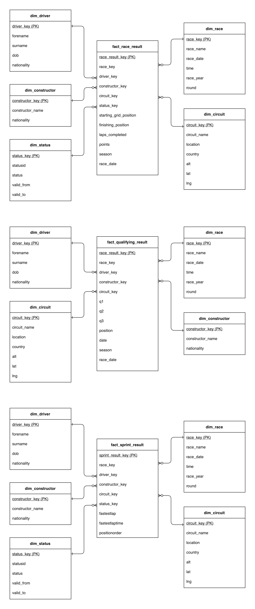
Figure: Kimball models created using dbt
 
 

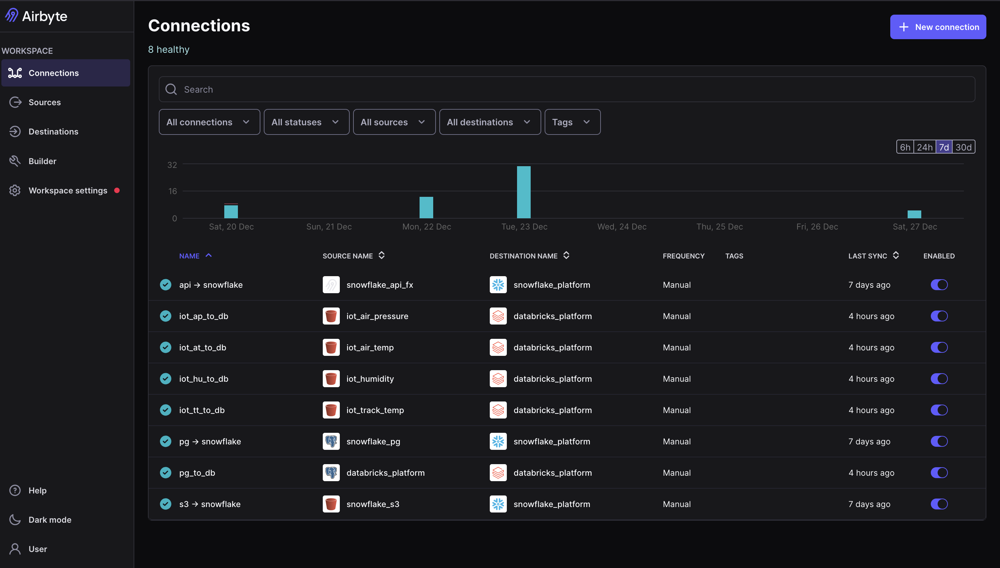
Figure: Airbye connections
 
 

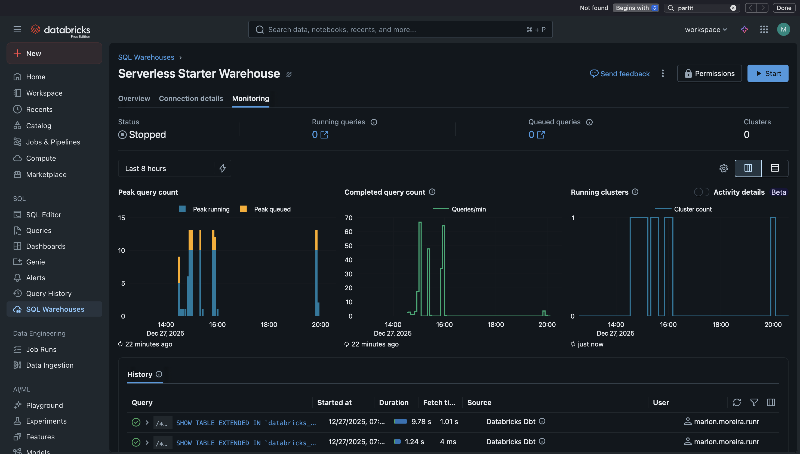
Figure: Databricks compute cluster monitoring
 
 

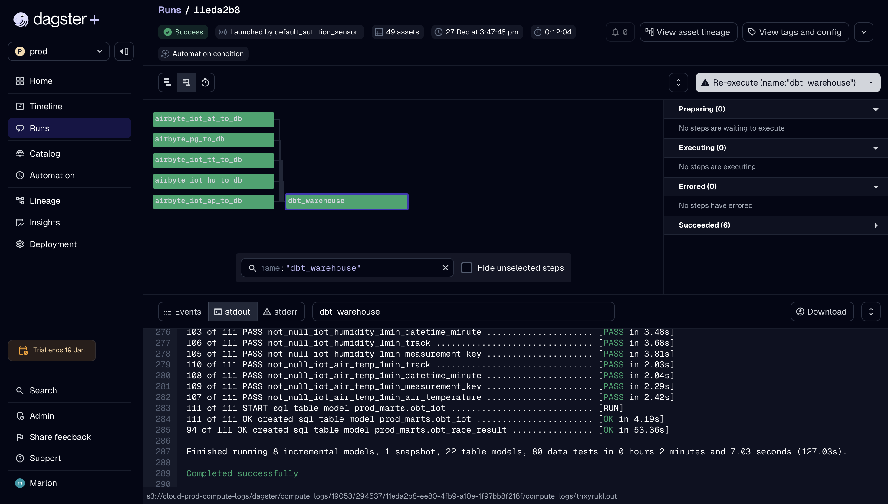
Figure: Dagster pipeline successful run
 
 

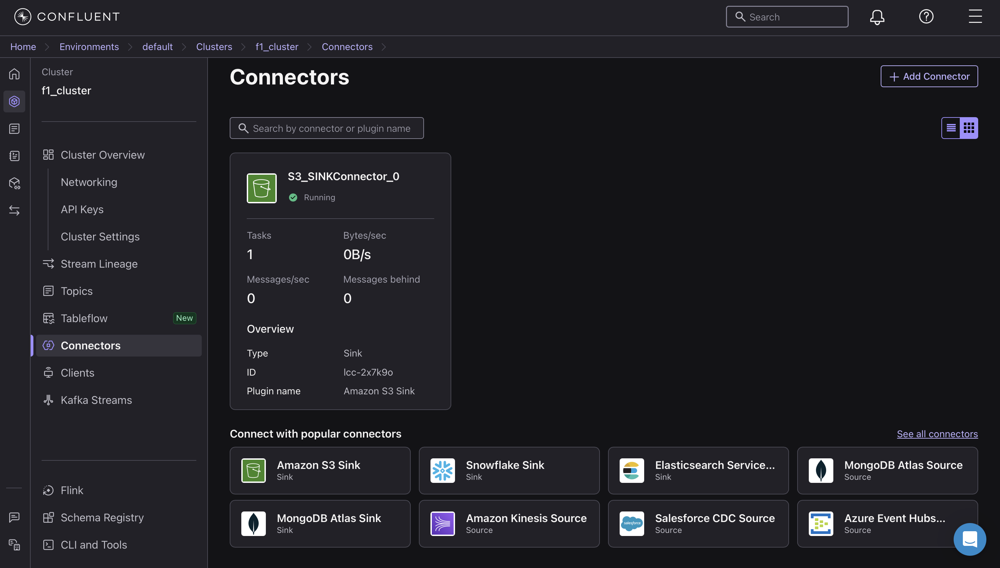
Figure: Confluent Kafka S3 connector
 
 

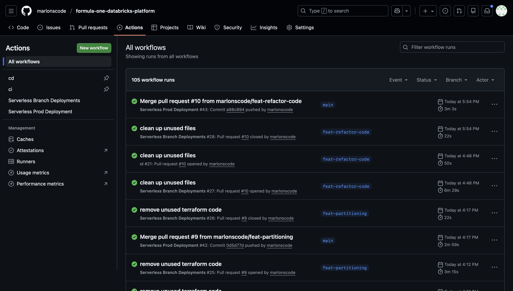
Figure: Github Actions workflow runs
 
 

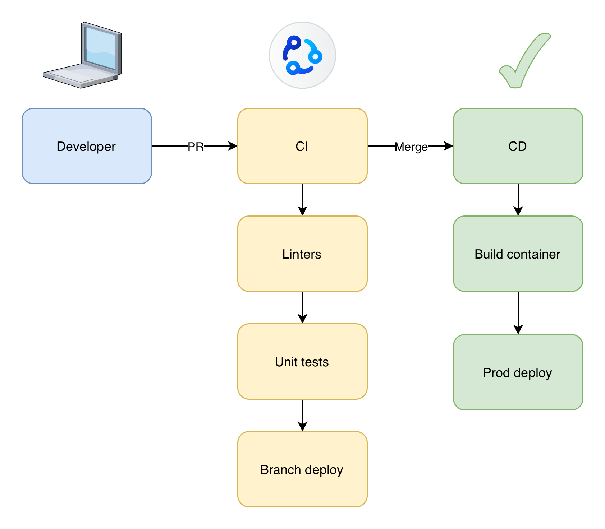
Figure: CI/CD flow diagram
 
 

